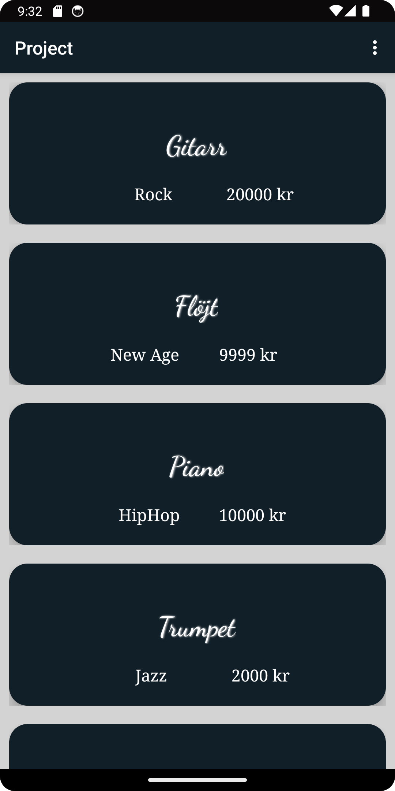
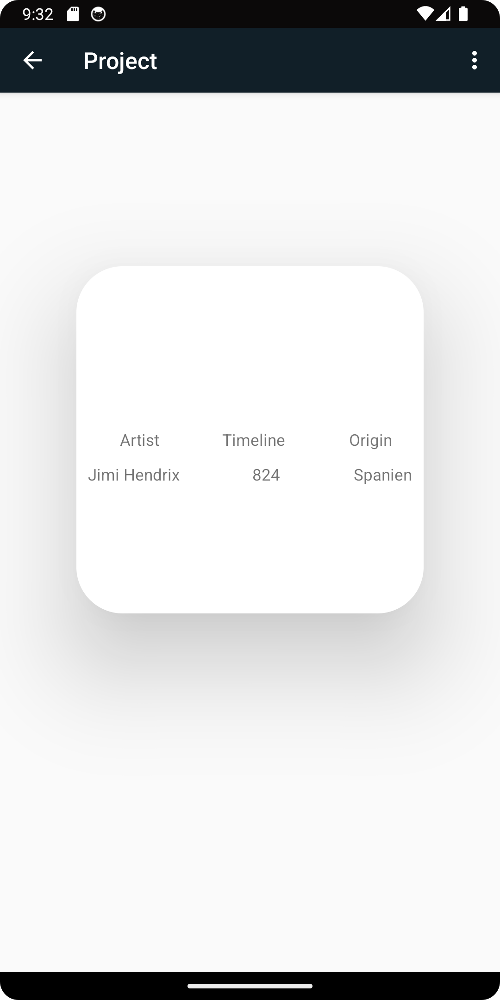
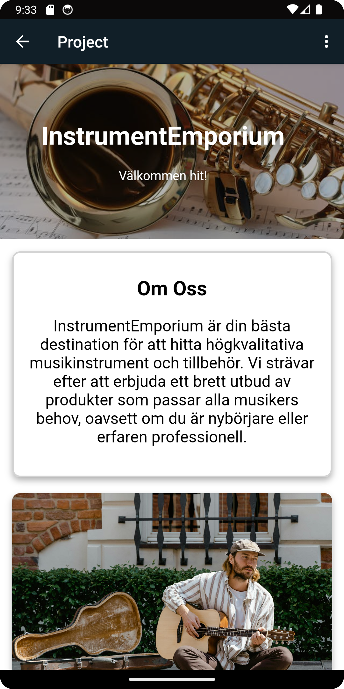

# Rapport
Projektet skapades genom att implementera en RecyclerView på activity_main.xml tillsammans med en webview. 
Sedan skapades en MusikInstrument klass för att kunna representera föremålen. Inuti klassen serialiserades vissa
av variablerna då datan kom i form av JSON i URL. Getters och konstruktorer bildades. En till klass togs fram enbart 
tänkt för JSON-URL. Skapade två nya klasser, RecyclerAdapter och RecyclerViewItem. Den andra skapades för att kunna 
använda den i MainActivity (Adaptern) och den andra är där man kopplar sina Views med föremålen från sin MusikInstrument klass (RecyclerViewItem).
Sedan skapades en layout fil för föremålen. Skapade nya activities, en för att kunna ta emot intents från MainActivity
och en annan för att min interna websidan ska vara en egen aktivitet genom att göra en load.url("...") som standard i onCreate. 
Skapade en about.html och en style.css i en asset folder
```

```



